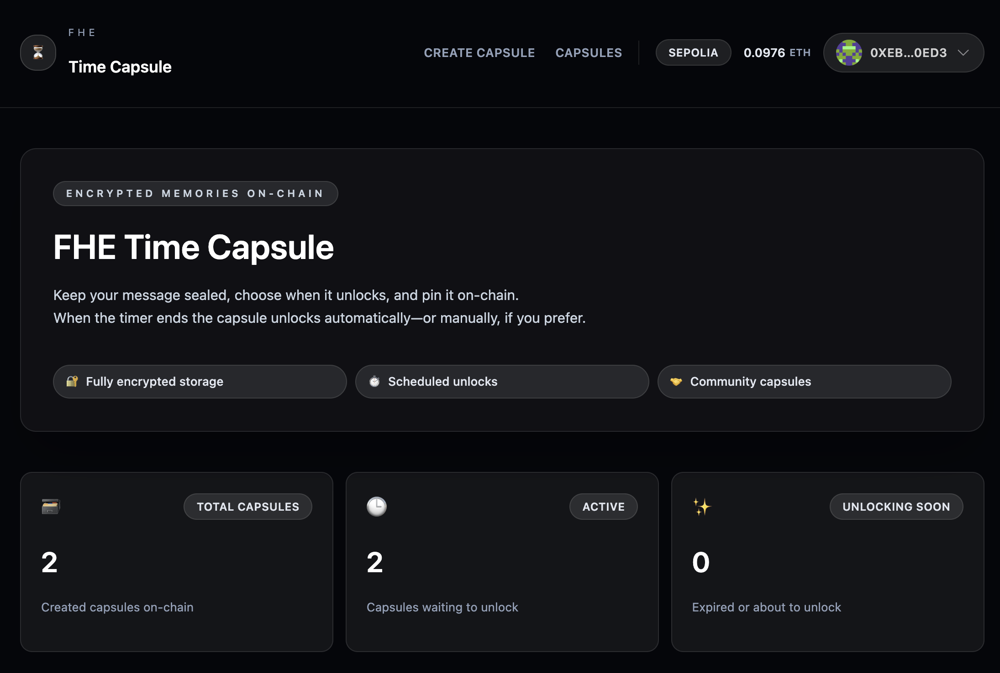

# 🔐 FHE Time Capsule

**Encrypted memories sealed on-chain, unlocked in the future.**

[](https://docs.zama.ai/protocol/)
[](https://nextjs.org/)
[](https://soliditylang.org/)

> **Author:** Funhar
>
> **Repository:** [https://github.com/Funhar/fhe-timecapsule](https://github.com/Funhar/fhe-timecapsule)
>
> **Issues:** [https://github.com/Funhar/fhe-timecapsule/issues](https://github.com/Funhar/fhe-timecapsule/issues)

[](https://docs.zama.ai/protocol/)
[](https://nextjs.org/)
[](https://soliditylang.org/)

## 🌟 Overview

<div align="center">
  
</div>

FHE Time Capsule is a revolutionary decentralized application that combines **Fully Homomorphic Encryption (FHE)** with blockchain technology to create truly private, time-locked messages. Create and unlock encrypted time capsules powered by FHE and blockchain technology.

### ✨ Key Features

- 🔐 **Zero-Knowledge Encryption**: Messages are encrypted before hitting the blockchain
- ⏰ **Time-Locked Capsules**: Set precise unlock times for future revelation
- 🌐 **Decentralized Storage**: All data stored on-chain with smart contract security
- 👥 **Community Discovery**: Browse and decrypt publicly shared capsules
- 🎨 **Beautiful Interface**: Modern, responsive design built with Next.js & Tailwind CSS

## 🏗️ Architecture

### Smart Contract (`FHETimeCapsule.sol`)

The heart of the application is a sophisticated Solidity smart contract that leverages **FHEVM** technology:

```solidity
// SPDX-License-Identifier: MIT
pragma solidity ^0.8.24;

import {
    FHE,
    ebool,
    eaddress,
    euint64,
    euint256,
    externalEuint64,
    externalEuint256
} from "@fhevm/solidity/lib/FHE.sol";
import {SepoliaConfig} from "@fhevm/solidity/config/ZamaConfig.sol";

contract FHETimeCapsule is SepoliaConfig {
    struct TimeCapsule {
        euint256[] encryptedMessage;    // FHE encrypted message chunks
        euint64 encryptedUnlockTime;    // FHE encrypted unlock timestamp
        ebool encryptedIsActive;        // FHE encrypted active state
        ebool encryptedIsUnlocked;      // FHE encrypted unlock state
        eaddress encryptedCreator;      // FHE encrypted creator address

        address creator;                // Plaintext creator for access control
        uint256 unlockTime;             // Plaintext unlock time for scheduling
        bool isActive;                  // Plaintext active flag for gas efficiency
        bool isUnlocked;                // Plaintext unlock flag for gas efficiency
    }

    // FHE-powered capsule creation with encrypted message chunks
    function createTimeCapsule(
        externalEuint256[] calldata encryptedMessageChunks,
        bytes[] calldata messageProofs,
        externalEuint64 encryptedUnlockTimeHandle,
        bytes calldata unlockTimeProof,
        uint256 unlockTime
    ) external returns (uint256 capsuleId) {
        // Store encrypted message chunks using FHE
        for (uint256 i = 0; i < encryptedMessageChunks.length; i++) {
            euint256 chunk = FHE.fromExternal(encryptedMessageChunks[i], messageProofs[i]);
            FHE.allowThis(chunk);
            capsule.encryptedMessage.push(chunk);
        }

        // Set encrypted unlock time with FHE verification
        capsule.encryptedUnlockTime = FHE.fromExternal(encryptedUnlockTimeHandle, unlockTimeProof);
        FHE.allowThis(capsule.encryptedUnlockTime);

        // Dual state management: plaintext for gas efficiency, encrypted for security
        capsule.unlockTime = unlockTime;
        capsule.isActive = true;
        capsule.encryptedIsActive = FHE.asEbool(true);
        FHE.allowThis(capsule.encryptedIsActive);
    }

    // Time-locked decryption with FHE permission system
    function openTimeCapsule(uint256 capsuleId) external {
        TimeCapsule storage capsule = timeCapsules[capsuleId];
        require(block.timestamp >= capsule.unlockTime, "Unlock time not reached");

        // Grant FHE decryption permissions to authorized users
        _allowCapsuleTo(capsuleId, msg.sender);
        capsule.isUnlocked = true;
        capsule.encryptedIsUnlocked = FHE.asEbool(true);
    }

    // FHE permission management for controlled access
    function _allowCapsuleTo(uint256 capsuleId, address recipient) internal {
        TimeCapsule storage capsule = timeCapsules[capsuleId];

        // Grant FHE decryption permissions for all encrypted fields
        FHE.allow(capsule.encryptedMessage, recipient);
        FHE.allow(capsule.encryptedUnlockTime, recipient);
        FHE.allow(capsule.encryptedIsActive, recipient);
        FHE.allow(capsule.encryptedIsUnlocked, recipient);
        FHE.allow(capsule.encryptedCreator, recipient);
    }
}
```

**Key FHE Capabilities:**
- **🔐 Encrypted Storage**: Messages stored as `euint256[]` chunks using FHE
- **⏰ Dual State Management**: Plaintext for gas efficiency, encrypted for security
- **🔑 Permission-Based Decryption**: Granular FHE access control with `FHE.allow()`
- **⚡ Homomorphic Operations**: Smart contract processes ciphertexts without decryption
- **🛡️ Zero-Knowledge Security**: Cryptographic proofs verify operations without revealing data

### Frontend Application

Built with modern web technologies for seamless user experience:

- **⚛️ React 18** with TypeScript for type-safe development
- **🎨 Tailwind CSS** for responsive, beautiful UI design
- **🌈 RainbowKit** for wallet connection and network management
- **📦 Wagmi** for efficient blockchain interactions
- **🔄 Real-time Updates** with live capsule status monitoring

**User Interface Highlights:**
- Intuitive capsule creation with live character counting
- Real-time encryption status and progress indicators
- Community capsule discovery and browsing
- Responsive design that works on all devices
- Dark theme optimized for developer experience

## 🚀 Quick Start

### Prerequisites

- **Node.js 20+** and **pnpm** package manager
- **MetaMask** browser extension for wallet connectivity
- **Git** for repository cloning

### Installation & Setup

```bash
# Clone the repository
git clone <repository-url>
cd fhe-time-capsule

# Initialize submodules (includes FHEVM dependencies)
git submodule update --init --recursive

# Install all dependencies
pnpm install

# Build the FHEVM SDK
pnpm sdk:build
```

### Development Environment

**Sepolia Testnet Deployment**

```bash
# Deploy contracts to Sepolia testnet
pnpm deploy:sepolia

# Start the development server
pnpm start
```

### 🔗 Connect Your Wallet

1. Open [http://localhost:3000](http://localhost:3000) in your browser
2. Click "Connect Wallet" and select MetaMask
3. Switch to the Sepolia testnet in your MetaMask wallet

## 💡 How It Works

### 1. **Message Creation**
- Write your message in the intuitive interface
- Choose a future unlock date and time
- Your message is encrypted client-side before blockchain submission

### 2. **Encrypted Storage**
- Message is split into encrypted chunks using FHE
- Each chunk stored as `euint256` on the smart contract
- Unlock time recorded both as plaintext (for scheduling) and encrypted (for verification)

### 3. **Time-Locked Security**
- Capsules remain locked until the specified unlock time
- Smart contract enforces time-based access control
- No one can decrypt the message before the unlock time

### 4. **Secure Revelation**
- At unlock time, capsules become available for decryption
- FHE permissions allow controlled access to encrypted content
- Messages revealed only to authorized parties

## 🔧 Technical Deep Dive

### FHEVM Integration

The application leverages **FHEVM** (Fully Homomorphic Encryption Virtual Machine) to enable computation on encrypted data:

- **Client-Side Encryption**: Messages encrypted before blockchain submission
- **Homomorphic Operations**: Smart contract can perform operations on ciphertexts
- **Decryption Keys**: Managed through secure FHE permission system
- **Relayer Network**: Off-chain computation for complex cryptographic operations

### Smart Contract Architecture

```solidity
struct TimeCapsule {
    euint256[] encryptedMessage;    // Encrypted message chunks
    euint64 encryptedUnlockTime;    // Encrypted unlock timestamp
    ebool encryptedIsActive;        // Encrypted active state
    eaddress encryptedCreator;      // Encrypted creator address
    // ... plaintext mirrors for gas efficiency
}
```

### Security Model

- **End-to-End Encryption**: Messages encrypted before leaving user device
- **Zero-Knowledge Proofs**: Cryptographic proofs verify operations without revealing data
- **Time-Based Access Control**: Mathematical enforcement of unlock schedules
- **Permission Delegation**: Granular control over who can decrypt capsules

## 📊 Project Structure

```
fhe-time-capsule/
├── 📦 packages/
│   ├── 🔗 fhevm-sdk/           # FHEVM SDK and utilities
│   ├── ⚖️ hardhat/             # Smart contracts & deployment
│   └── ⚛️ nextjs/              # React frontend application
├── 🔧 scripts/                 # Build and deployment automation
└── 📚 README.md               # Project documentation
```

## 🌐 Network Support

- **Testnet**: Sepolia testnet
- **Multi-Network Ready**: Easy configuration for additional networks

##  Resources & Documentation

### Official Documentation
- [FHEVM Documentation](https://docs.zama.ai/protocol/solidity-guides/) - Complete FHEVM guide
- [Next.js Documentation](https://nextjs.org/docs) - Frontend framework reference
- [Solidity Documentation](https://docs.soliditylang.org/) - Smart contract language

### Development Tools
- [Hardhat Documentation](https://hardhat.org/docs) - Ethereum development environment
- [Wagmi Documentation](https://wagmi.sh/) - React hooks for Ethereum
- [RainbowKit Documentation](https://www.rainbowkit.com/docs) - Wallet connection library

### Community & Support
- [Discord Zama Community](https://discord.gg/zama) - Get help and connect with other developers
